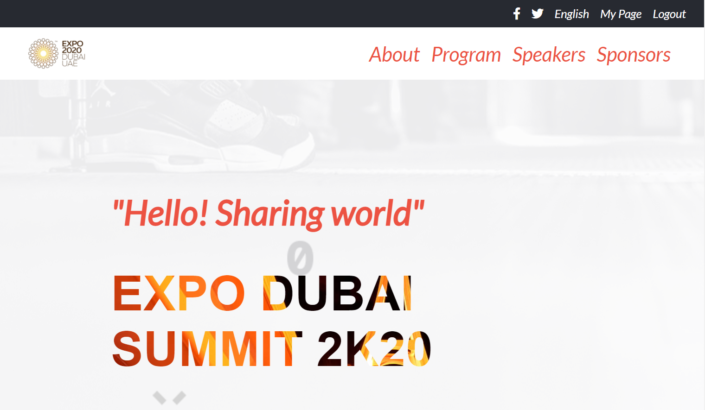
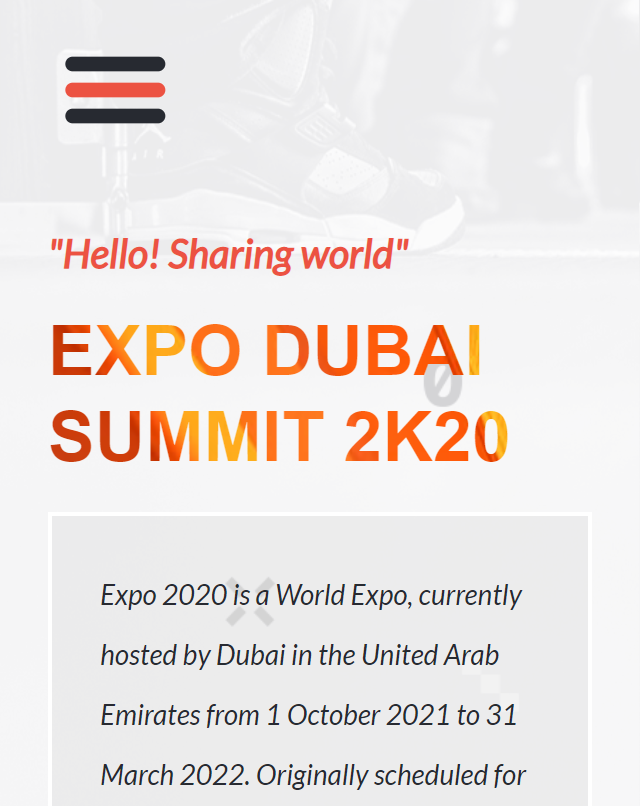
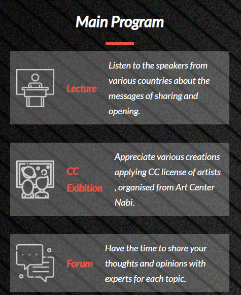

# Conference-page

> This project is based on an online website for EXPO DUBAI 2K20.

  

  

  

## Built with

- HTML
- CSS
- Flexbox
- Grid
- mobile-first method
- JavaScript

## Live demo

[My live demo](https://tahenybelguith.github.io/conferencePage/) 

## Getting Started

> To get a local copy up and running follow these simple example steps.

### Prerequisites

- Github Account
- IDE
- Git

### Setup

- git init
- git clone git@github.com:TahenyBELGUITH/conferencePage.git

## Authors

### 👩 Taheny BELGUITH

- GitHub: [@TahenyBELGUITH](https://github.com/TahenyBELGUITH)
- Twitter: [@BelguithTaheny](https://twitter.com/BelguithTaheny)

### 🤝 Contributing

Contributions, issues, and feature requests are welcome!

> Feel free to check the issues page.

### Show your support

Give a ⭐️ if you like this project!

### Acknowledgments
- Hat tip to Microvers for giving me this project,
- Hat tip to Cindy Chin for providing me the the design tempate used on thi project
- Hat tip to All my peers in Microverse who gave me ides and suggestions to improve this website.

### 📝 License

This project is MIT licensed.
